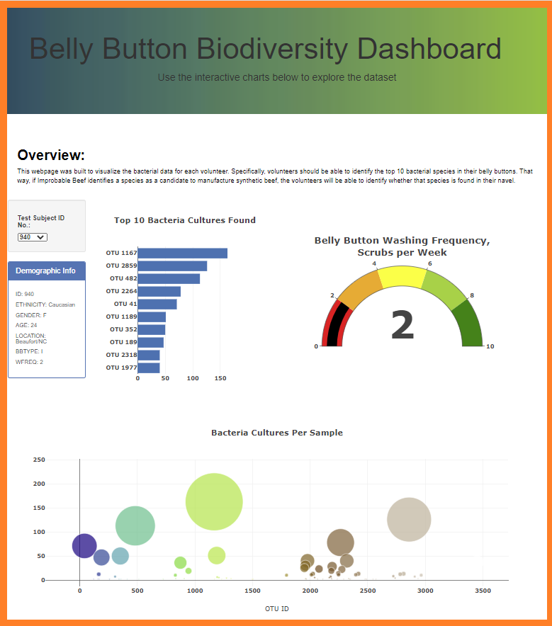

# Bellybutton-Biodiversity
New project on Bellybutton-Biodiversity analysis. Adjusting the current web app.

## Project Overview
Using knowledge of ;`JavaScript`, `Plotly`, and `D3.js`, a horizontal bar chart will be created to display the top 10 bacterial species (OTUs) when an individual’s ID is selected from the dropdown menu on the webpage. Ergo, this assignment consists of three technical deliverables. They are:

- Deliverable 1: Create a Horizontal Bar Chart - will display the sample_values as the values, the otu_ids as the labels, and the otu_labels as the hover text for the bars on the chart.
- Deliverable 2: Create a Bubble Chart - will display the following when an individual’s ID is selected from the dropdown menu webpage
- Deliverable 3: Create a Gauge Chart - displays the weekly washing frequency's value, and display the value as a measure from 0-10 on the progress bar in the gauge chart when an individual ID is selected from the dropdown menu
- Deliverable 4: Customize the Dashboard - will display three additional webpage customizations

## Purpose
The purpose of this project is to visualize the bacterial data for each volunteer. Specifically, volunteers should be able to identify the top 10 bacterial species in their belly buttons. That way, if Improbable Beef identifies a species as a candidate to manufacture synthetic beef, thevolunteers will be able to identify whether that species is found in their navel.

## Resources
- **Webpage:** https://llisha-bleu.github.io/BellyButton-Biodiversity/
- **Data Source:** `chartz.js`, `index.html`, `samples.json`, `image.jpg`
- **Software:** `VS Code`, `Web Browser`, `Command-line interface`, `GitHub`

## Bellybutton-Biodiversity Results
>
>**Image showing the Bellybutton-Biodiversity web app:**
>
>
